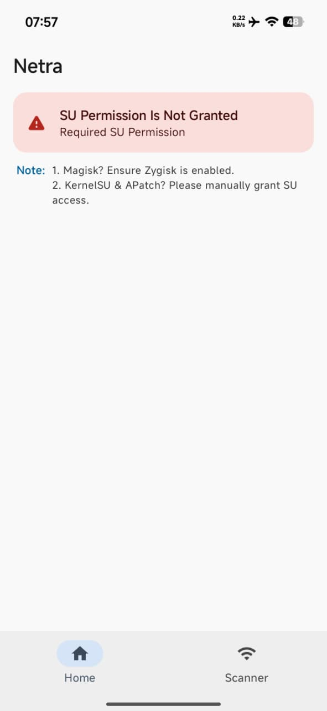
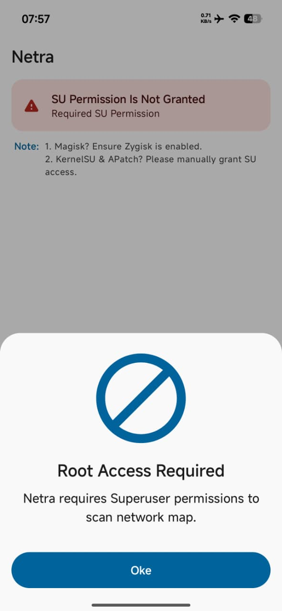
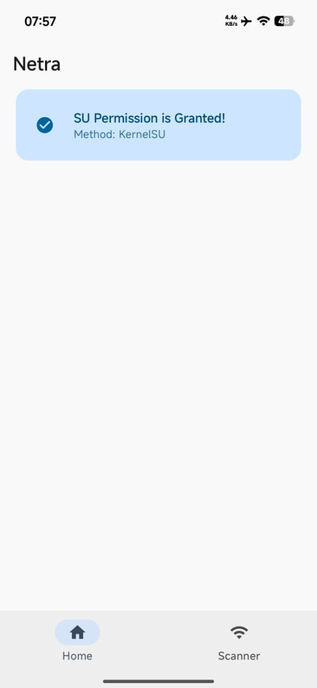
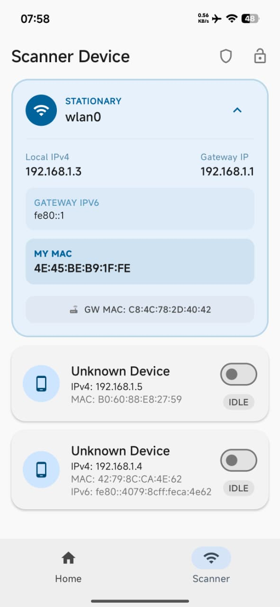
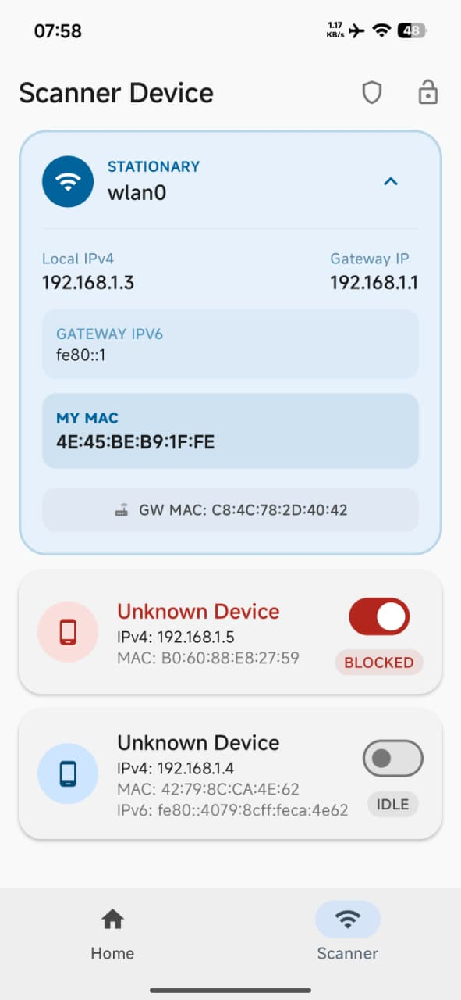
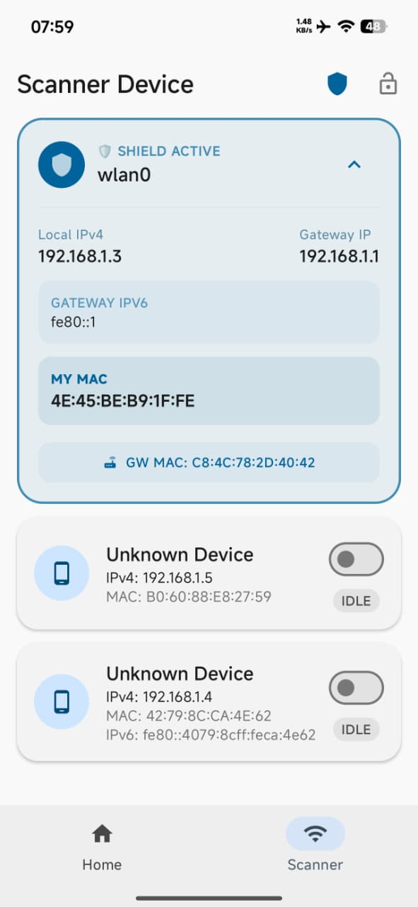
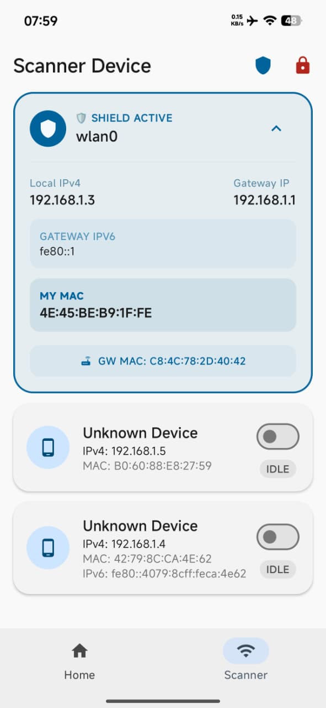

# Netra

  

  <strong>Root-based network security for Android. Built to defend, not to exploit.</strong>

  
  
  
  

---

## Overview

**Netra** is a network security application for rooted Android devices, engineered to detect and neutralize real-time network threats — including ARP spoofing, Man-in-the-Middle (MITM) attacks, and unauthorized device activity on local networks.

Operating through deep OS-level integration via KernelSU, Netra provides a layer of active defense that Android's native stack simply does not offer. It is designed for security-conscious users, researchers, and professionals who need granular visibility and control over their network environment.

> The source code is kept private due to the sensitive nature of its capabilities.
> For access inquiries or collaboration, reach out via Telegram: [@NetraOfficial](https://t.me/NetraOfficial)

---

## Ethical Use & Disclaimer

Netra is developed strictly for **defensive and educational purposes**.

This application is intended to help users protect their own devices and networks from unauthorized access and network-layer attacks. It is **not** designed, distributed, or intended for use against networks, devices, or systems you do not own or have explicit authorization to test.

Misuse of this tool — including unauthorized network scanning, traffic interception, or IP blocking on systems you do not control — may violate local laws and regulations, including the **Undang-Undang ITE (UU No. 19 Tahun 2016)** in Indonesia and equivalent cybercrime legislation in other jurisdictions.

**By using Netra, you agree to use it solely for lawful, authorized, and ethical purposes. The developer assumes no liability for misuse.**

---

## Screenshots

**Root Permission Flow**

  
  &nbsp;
  
  &nbsp;
  

  No SU Permission &nbsp;·&nbsp; Root Access Required &nbsp;·&nbsp; SU Granted (KernelSU)

**Scanner & Protection**

  
  &nbsp;
  
  &nbsp;
  
  &nbsp;
  

  Network Scan &nbsp;·&nbsp; IP Blocked &nbsp;·&nbsp; ARP Shield Active &nbsp;·&nbsp; Shield + Lock

---

## Features

| Feature | Description |
| :--- | :--- |
| **IP Scan** | Real-time detection of all devices on your local network, with automatic flagging of suspicious or unauthorized activity. |
| **IP Block** | Granular control to block specific malicious or unwanted IP addresses — individually or all at once. |
| **ARP Spoofing Shield** | Active defense layer that intercepts and neutralizes ARP spoofing attempts before traffic is compromised, preventing MITM attacks at the network level. |
| **User-Friendly UI** | Clean, minimal interface built to modern Android design standards — built for clarity under pressure. |

---

## How It Works

Netra operates at the OS level using root access granted through KernelSU. This allows the application to:

- Directly inspect ARP tables and detect poisoning attempts in real-time
- Issue IP-level block rules through the Android networking stack
- Monitor the local network continuously without relying on VPN-based workarounds
- Respond to threats without requiring user intervention once protection is enabled

This approach differs fundamentally from VPN-based "security apps" that only tunnel traffic — Netra intercepts threats before they reach your device's network layer.

---

## Compatibility

- **Root Solution:** KernelSU (recommended), Magisk
- **Architecture:** All major CPU architectures supported — armeabi-v7a, arm64-v8a
- **Network:** Works on most Wi-Fi networks (2.4 GHz and 5 GHz)
- **Android Version:** Android 10 and above recommended

---

## Installation

1. Download the latest **Netra APK** from the [Releases](https://github.com/netra-hck/Netra/releases) section.
2. Install the APK on your rooted Android device.
3. Open Netra and grant root (SU) access when prompted.
4. Allow network scanning permissions.
5. Enable the protection modules as needed.

> Make sure your device is already rooted via KernelSU or Magisk before installation.

---

## Discussion & Support

- **Telegram:** [@NetraOfficial](https://t.me/NetraOfficial)

For bug reports, feature requests, or responsible disclosure of vulnerabilities found within Netra itself, please reach out via Telegram.

---

## License

Netra is released under the **Netra Personal License (NPL)**.

- **Copyright:** All code and assets are copyrighted © 2026 **Netra**.
- Redistribution, modification, or commercial use of any part of this application is strictly prohibited without prior written permission from the developer.
- The source code is proprietary and not publicly available.

---

## Credits

**Netra** — Application development, network security architecture, and implementation.

---

  Built with intent. Used with responsibility.

